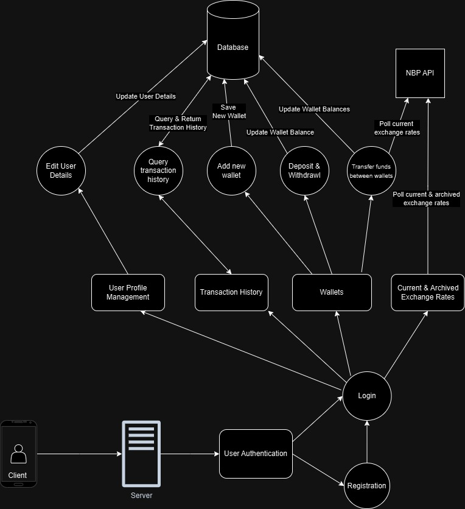
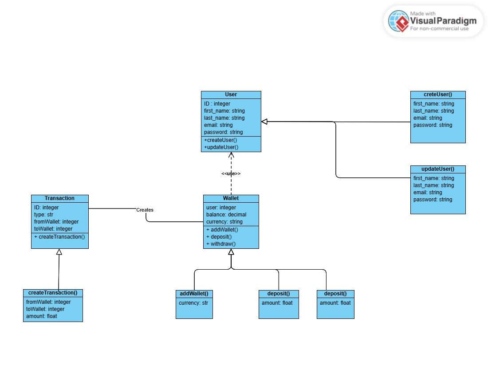
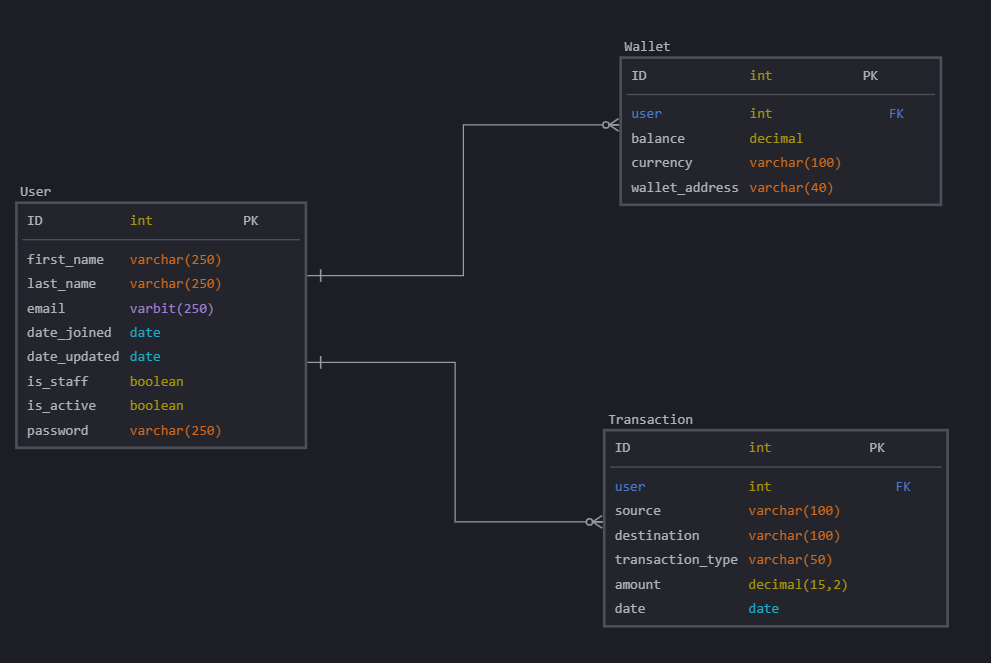
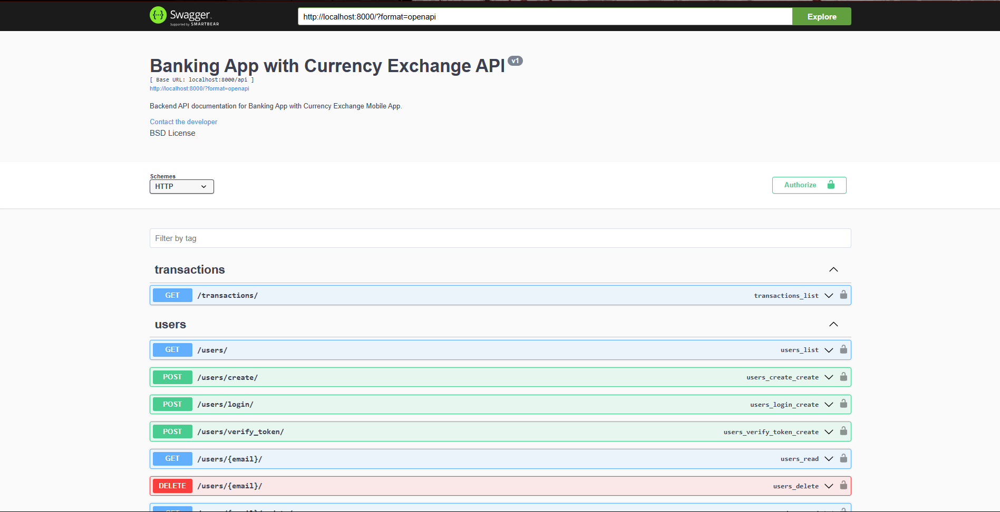

# Banking App with Currency Exchange - [Network Communications in Mobile Appplcation Development (Semester 7)]

## Table of Contents
1. [Overview](#overview)
2. [Tech Stack](#tech-stack)
3. [Authentication](#authentication)
4. [API Endpoints](#api-endpoints)
   - [User Endpoints](#user-endpoints)
   - [Transaction Endpoints](#transaction-endpoints)
   - [Wallet Endpoints](#wallet-endpoints)
5. [Models](#models)
6. [Currency Exchange](#currency-exchange)
7. [Error Handling](#error-handling)
8. [Conclusion](#conclusion)

---

## Overview

**Banking App with Currency Exchange** allows users to manage their accounts, wallets, and transactions, while also supporting currency exchange via integration with the **NBP API** for live exchange rates when tranferring funds between wallets and also for checking the exchange rates both current and archived rates.

This the backend API built using **Django** and **Django Rest Framework** (DRF) for building RESTful web services. The **NBP API** is used for fetching current exchange rates when users transfer funds between wallets.

You can access the full working <a href="https://github.com/javokhirbek1999/currency-exchange-mobile-client" target="_blank">**Mobile App**</a> documentation in order to run and check it.

## Use-case diagram

## Class diagram

## Database Desgin Diagram

For more detailed API Documentation, you can navigate to main endpoint depending on the IP address you are running.
 
 
(EX: http://localhost:8000/)

Once you access the main url, you will see the following API documentation done using Swagger:

In the documentation:
- You can see all of the available endpoints
- You can authorize user using Token Authentication
- You can see all of databse models
- Get more details about request and response formats

**REMINDER**: First, you need to get token authentication at `api/users/login` and authorize it using Token Authorization by clicking `Authorize` button you can see on Swagger API documentation in order to be able to use all of the API endpoints.

---

## Tech Stack

The **Banking App with Currency Exchange** is developed using the following technologies:

- **Django**: A Python-based web framework for building backend systems.
- **Django Rest Framework (DRF)**: A powerful toolkit for building RESTful APIs in Django.
- **NBP API**: A Polish National Bank API providing exchange rate data.
- **Swagger**: API documentation and testing interface.

---

## Authentication

To interact with most of the API, you must authenticate as a registered user. The authentication mechanism uses **Authentication tokens**.

### User Registration and Login

- **POST** `/users/register/` - Register a new user.
  - **Body Parameters**:
    - `email`: User's email.
    - `first_name`: User's first name.
    - `last_name`: User's last name.
    - `password`: User's password.
    - `confirm_password`: Password confirmation.
  
- **POST** `/users/login/` - Login to obtain a authorization token.
  - **Body Parameters**:
    - `email`: User's email.
    - `password`: User's password.

  - **Responses**:
    - **200 OK**: A successful response includes token for use in subsequent requests.
    - **401 Unauthorized**: If credentials are invalid or not provided.

---

## API Endpoints

The following endpoints are available to interact with the Banking App:

### **1. User Endpoints**

#### `GET /users/`
- **Description**: Retrieve all users (admin only).
- **Responses**: List of all users with details like `email`, `first_name`, and `last_name`.

#### `POST /users/register/`
- **Description**: Register a new user.
- **Parameters**:
  - `email`, `first_name`, `last_name`, `password`, `confirm_password`.

#### `POST /users/login/`
- **Description**: Log in and obtain a JWT token.
- **Parameters**:
  - `email`, `password`.

#### `GET /users/{email}/`
- **Description**: Retrieve a user's details using their email.
- **Parameters**: `email` (path parameter).
  
#### `PUT /users/{email}/update/`
- **Description**: Update user details (email, name, password).
- **Parameters**:
  - `first_name`, `last_name`, `email`, `new_password`, `current_password`.

#### `DELETE /users/{email}/`
- **Description**: Delete a user by email (admin only).
- **Parameters**: `email` (path parameter).

### **2. Transaction Endpoints**

#### `GET /transactions/`
- **Description**: List all transactions for the authenticated user.
- **Parameters**: None.
  
#### `POST /transactions/`
- **Description**: Create a new transaction.
- **Parameters**:
  - `source`: Source wallet address.
  - `destination`: Destination wallet address.
  - `transaction_type`: Type of transaction (e.g., "Deposit", "Withdrawal").
  - `amount`: Transaction amount (decimal).
  - `date`: Transaction date.

#### `POST /transactions/transfer/`
- **Description**: Transfer funds between wallets with currency conversion.
- **Parameters**:
  - `source_wallet_id`: Source wallet ID.
  - `destination_wallet_id`: Destination wallet ID.
  - `amount`: Amount to transfer.
  - `currency`: Currency of the transfer.

### **3. Wallet Endpoints**

#### `GET /wallets/`
- **Description**: List all wallets for the authenticated user.
- **Parameters**: None.

#### `POST /wallets/`
- **Description**: Create a new wallet for the authenticated user.
- **Parameters**:
  - `currency`: Currency of the wallet.

#### `GET /wallets/{currency}/`
- **Description**: Retrieve, update, or delete a wallet by currency.
- **Parameters**:
  - `currency`: Currency of the wallet (path parameter).

#### `PUT /wallets/{currency}/deposit/`
- **Description**: Deposit funds into a wallet.
- **Parameters**:
  - `bank_account_address`: Bank account address for the deposit.
  - `amount`: Amount to deposit.

#### `PUT /wallets/{currency}/withdraw/`
- **Description**: Withdraw funds from a wallet.
- **Parameters**:
  - `bank_account_address`: Bank account address for the withdrawal.
  - `amount`: Amount to withdraw.

#### `DELETE /wallets/{currency}/`
- **Description**: Delete a wallet.
- **Parameters**:
  - `currency`: Currency of the wallet (path parameter).

---

## Database Models

The following are the models used in the Banking App API:

### Transaction Model - 
automatically created when users performs deposit/withdrawl/transfer using signals

 
- **user**: Integer (User ID).
- **source**: String (Source wallet address).
- **destination**: String (Destination wallet address).
- **transaction_type**: String (Type of transaction: "Deposit", "Withdrawal").
- **amount**: String (Amount in decimal).
- **date**: String (Date of transaction).
- **source_wallet_details**: String (Details of the source wallet).

### **User Model**
- **email**: String (User's email).
- **first_name**: String (User's first name).
- **last_name**: String (User's last name).
- **date_joined**: String (Date joined).
- **date_updated**: String (Date updated).
- **password**: String (Password).
- **is_staff**: Boolean (Indicates if the user is staff).
- **is_active**: Boolean (Indicates if the user is active).

### **Wallet Model**
- **id**: Integer (Wallet ID).
- **balance**: String (Balance of the wallet).
- **currency**: String (Currency of the wallet).
- **wallet_address**: String (Address of the wallet).
- **user**: Integer (User ID who owns the wallet).

---

## Currency Exchange

The **Banking App with Currency Exchange** integrates with the <a href="https://api.nbp.pl/" target="_blank">**NBP API**</a> (Polish National Bank API) to provide live currency exchange rates. This API is used when users performs transfers while transferring funds.

- The available currencies are fetched dynamically from the NBP API.
- When transferring funds between wallets in different currencies, the app automatically applies the current exchange rate.

---

## Conclusion

This API powers the **Banking App with Currency Exchange** Mobile App, enabling users to manage their accounts, wallets, transactions, and perform currency conversions using real-time exchange rates from the <a href="https://api.nbp.pl/" target="_blank">**NBP API**</a>.

For more details on how to interact with the API, refer to the endpoint descriptions or main home endpoint for more details API documentation and usage. Feel free to explore the API through Swagger or use the provided authentication to test requests.

---
